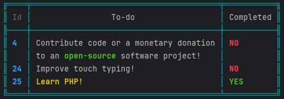

# PHP CLI Table
---




This project's functionality was inspired by [clitable](https://github.com/jc21/clitable) 
and was created because I wanted some additional functionality. The code has undergone 
a full re-write with a bunch of changes to behaviour and functionality

## Features

- Print table from data array without defining additional config
- Define custom table columns
- Create formatters for fields using closures
- Colorize headers, columns, rows and individual cells conditionally using closures
- *[Not well tested]* Colorize text within a table cell

## Requirements

- PHP 8.1 or higher
- [Composer set up in the desired project](https://getcomposer.org/doc/01-basic-usage.md)
- A CLI environment to run PHP scripts

## Installation

```shell
composer require spydr97/php-cli-table
```


## Usage

### Basic Usage
For detailed examples and more complex usage please see the scripts in the example folder
The bare minimum required to render a table is the following.
```php
use Spydr97\PhpCliTable\CliTableBuilder;

$data = [
    [
        'id' => 1,
        'name' => 'Hello',
    ],
    [
        'id' => 2,
        'text' => 'World',
    ],
];

(new CliTableBuilder())
    ->setData($data)
    ->build();
```

### Builder Methods

In the absence of proper documentation, (I haven't decided how I want to do that just yet) here are the methods exposed
by the `CliTableBuilder` that can be used to manipulate the resultant table. 

- `setData(array $data)` - sets the data array to populate the table
- `setFields(array $fields)` - sets the fields array to define table columns
- `setBorderColor(TextColorEnum $color)` - sets the color of the table border
- `setHeaderColor(TextColorEnum $color)` - sets the default color of each table heading (superseded by the 
`FIELD_HEADER_COLOR` property in a field definition)
- `setCellColor(TextColorEnum $color)` - sets the default color of each table cell (superseded by the 
`FIELD_COLUMN_COLOR` property in a field definition or `DATA_COLOR` property in a data item)
- `setEmptyCellPlaceholder(string $empty_cell_placeholder)` - sets the text to show when the particular data item value
does not exist
- `setShowHeader(bool $show_header)` - sets whether to show or hide table headings
- `build()` - validates data and prints the table to the console

### Colors

Colors are defined in the `\Spydr97\PhpCliTable\TextColorEnum` class. The following colors are available

- `TextColorEnum::BLACK`
- `TextColorEnum::WHITE`
- `TextColorEnum::DARK_RED`
- `TextColorEnum::RED`
- `TextColorEnum::DARK_GREEN`
- `TextColorEnum::GREEN`
- `TextColorEnum::DARK_YELLOW`
- `TextColorEnum::YELLOW`
- `TextColorEnum::DARK_BLUE`
- `TextColorEnum::BLUE`
- `TextColorEnum::DARK_CYAN`
- `TextColorEnum::CYAN`
- `TextColorEnum::LIGHT_GREY`
- `TextColorEnum::DARK_GREY`
- `TextColorEnum::RESET`

### Data

In addition to data fields, each row can have a `_color` (`DataConstants::DATA_COLOR`) property which defines the 
color of the particular row. This can either be of type `TextColorEnum` or `Closure`. If a `TextColorEnum` is used 
then the color is applied on the whole row. If a `Closure` is used the color can either be applied to the whole 
row or to specific fields.

A `DataConstants::DATA_COLOR` closure is provided two params, `$datum` and `$field` which correspond to the current 
data row item and column field definition respectively. The return type of this closure must be either a 
`TextColorEnum` or `null`.

e.g. This closure sets the color of every column for the particular row to `BLUE` except the `text` column which 
is left as the configured default (i.e. not overridden).
```php
use \Spydr97\PhpCliTable\Constants\DataConstants;
...
$data = [
   ...
   DataConstants::DATA_COLOR => function (array $datum, array $field): ?TextColorEnum {
            if ($field[FieldConstants::FIELD_KEY] == 'text') {
                return null;
            }
            return TextColorEnum::BLUE;
        }
]
```

### Fields

Fields can have the following properties defined. 

| Property Name | Type                           | Closure Return Type         | Required | FieldConstant        |
|---------------|--------------------------------|-----------------------------|----------|----------------------|
| Key           | `String`                       | ---                         | `true`   | `FIELD_KEY`          |
| Name          | `String`                       | ---                         | `false`  | `FIELD_NAME`         |
| Column Color  | `TextColorEnum` <br/>`Closure` | `TextColorEnum` <br/>`null` | `false`  | `FIELD_COLUMN_COLOR` |
| Header Color  | `TextColorEnum` <br/>`Closure` | `TextColorEnum` <br/>`null` | `false`  | `FIELD_HEADER_COLOR` |
| Formatter     | `Closure`                      | `String`                    | `false`  | `FIELD_FORMATTER`    |

The closure definitions for the above Closures are as follows:

```php
use Spydr97\PhpCliTable\Constants\FieldConstants;
...
$fields = [
    ...
    [
        ...
        FieldConstants::FIELD_HEADER_COLOR => function (array $field): ?TextColorEnum {
            return TextColorEnum::DARK_RED;
        },
       
        FieldConstants::FIELD_COLUMN_COLOR => function (array $datum, array $field): ?TextColorEnum {
            return TextColorEnum::DARK_RED;
        },
       
        FieldConstants::FIELD_FORMATTER => function (array $datum, array $field): string {
            return strtoupper($datum[$field[FieldConstants::FIELD_KEY]]);
        },
        ...
    ]
]

```
Please note that the `FieldConstants::FIELD_HEADER_COLOR` closure only has a single parameter `$field`. 
